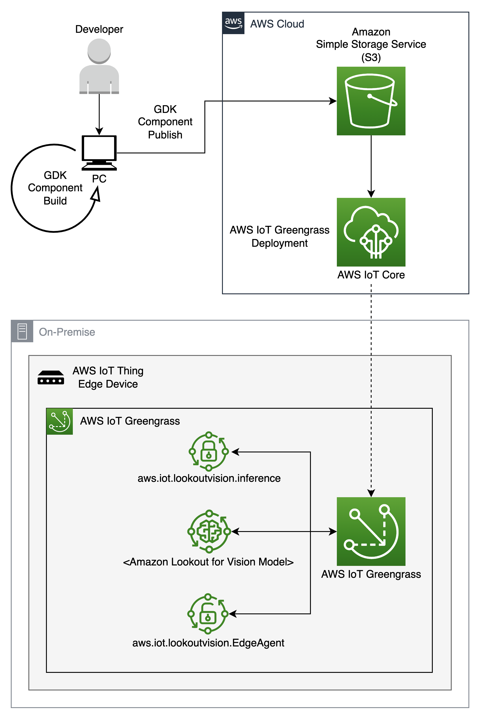

## Amazon Lookout for Vision at Edge C++ Inference Client with AWS IoT Greengrass Component

### Introduction
This repository shows an example of creating an [AWS IoT Greengrass V2 Component](https://aws.amazon.com/greengrass/) for [Amazon Lookout for Vision](https://aws.amazon.com/lookout-for-vision/) Inference Client using C++. The task of this component is to run Inference for Amazon Lookout for Vision model in an IoT device. This build creates an automated way to build Inference binaries and also create the AWS IoT Greengrass V2 Component using [GDK CLI](https://docs.aws.amazon.com/greengrass/v2/developerguide/greengrass-development-kit-cli.html) which uses the binaries to run Inference and generate results.


### AWS Architecture



### Content Structure
```
.
├── .
├── .gitignore
├── .gitmodules
├── CODE_OF_CONDUCT.md
├── CONTRIBUTING.md
├── LICENSE
├── local-gdk-build.sh
├── README.md
├── NOTICE
├── THIRD_PARTY_LICENSES
├── aws.iot.lookoutvision.inference/
│   ├── gdk-config.json
│   ├── recipe.yaml
│   ├── revision
│   └── version
├── lookoutvision-inference-src/
|   ├── cmake/
│   │   └── common.cmake
│   ├── proto/
│   │   └── edge-agent.proto
│   ├── src/
│   │   └── main.cc
│   └── third_party/
│       ├── grpc/
│       └── opencv/
└── screenshots
    ├── AWSArchitecture.png
    └── ComponentScreenshot1.png, ComponentScreenshot2.png, ComponentScreenshot3.png
```

* Directories:
    - `lookoutvision-inference-src`: Source files for creating the binaries to run the Inference client
    - `aws.iot.lookoutvision.inference`: Build files for creating the AWS IoT Greengrass V2 Component using [GDK CLI](https://docs.aws.amazon.com/greengrass/v2/developerguide/greengrass-development-kit-cli.html)


### Pre-requisites:
- AWS Console access and [AWS CLI](https://aws.amazon.com/cli/)
- Run `$ aws configure` and add the right AWS Credentials
- Setup [AWS Identity and Access Management (IAM) Policies](https://docs.aws.amazon.com/IAM/latest/UserGuide/introduction.html) for AWS IoT Greengrass V2 to access Amazon S3 bucket and Amazon Lookout for Vision to access AWS IoT Greengrass and Amazon S3 bucket
- [Amazon Lookout for Vision model compiled for IoT Edge deployment](https://aws.amazon.com/blogs/machine-learning/amazon-lookout-for-vision-now-supports-visual-inspection-of-product-defects-at-the-edge/) and create an AWS IoT Greengrass V2 Component of the model
- IoT Device is setup with AWS IoT Greengrass V2
- Understanding of C++ Coding and Bash scripts
- High-level understanding of [gRPC](https://grpc.io/), [Protocol Buffers](https://developers.google.com/protocol-buffers), and [OpenCV](https://opencv.org/) C++ API


### How to build the Component:
- Use the Local GDK Build Bash script: This would do 2 tasks: (1) Build binaries from `lookoutvision-inference-src`, and, (2) Build & Publish AWS IoT Greengrass V2 Component from `aws.iot.lookoutvision.inference`
```
$ bash local-gdk-build.sh
```

1. How binaries are built from `lookoutvision-inference-src`?
    - Builds [gRPC](https://grpc.io) and [OpenCV](https://opencv.org) from the `lookoutvision-inference-src/third_parties`
    - Builds binaries for running inference and links dependencies of [gRPC](https://grpc.io) and [OpenCV](https://opencv.org)
    - Zips the packages into a tar.gz which will be used for building the Component

2. How AWS IoT Greengrass V2 Component is built from `aws.iot.lookoutvision.inference`?
    - Using the `tar.gz` obtained from above process which has the Inference binaries and dependencies of [gRPC](https://grpc.io) & [OpenCV](https://opencv.org)
    - Builds the Component using [GDK CLI](https://docs.aws.amazon.com/greengrass/v2/developerguide/greengrass-development-kit-cli.html)
    - Publishes the Component given AWS Credentials are provided
    - Updates the Component revision version for building and publishing next time


### What all needs to change?
- Updating the Amazon S3 Bucket in `aws.iot.lookoutvision.inference/gdk-config.json` to point to the right bucket
- Updating the AWS Region in `aws.iot.lookoutvision.inference/gdk-config.json` to point to the right region
- Based on what input needs to go, make changes to `Input` in `aws.iot.lookoutvision.inference/recipe.yaml`
    - Example: For image file: `Input: "/path/to/images/test.jpeg"`
    - Example: For camera: `Input: "0"`
    - Example: For video file: `Input: "/path/to/videos/test.mp4"`
- Based on what is the Amazon Lookout for Vision model Component name, make changes to `Model`


#### Examples: 
- Lets assume we have an Amazon Lookout for Vision model with AWS IoT Greengrass V2 Component name as: `test-lfv-model`. The changes in the `aws.iot.lookoutvision.inference/recipe.yaml` file should be as follows:
1. Using static image stored in location `/home/ubuntu/username/images/earth.png`:
```
    "DefaultConfiguration": {
        "Input": "/home/ubuntu/username/images/earth.png",
        "Model": "test-lfv-model"
    }
```
2. Using a video stored in location `/home/ubuntu/username/videos/birds.mp4`:
```
    "DefaultConfiguration": {
        "Input": "/home/ubuntu/username/videos/birds.mp4",
        "Model": "test-lfv-model"
    }
```
3. Using a USB camera connected at `0`:
```
    "DefaultConfiguration": {
        "Input": "0",
        "Model": "test-lfv-model"
    }
```


### What happens after Component is published?
- Once everything runs successfully, the AWS IoT Greengrass V2 Component named `aws.iot.lookoutvision.inference` would be available in the AWS Account and can be viewed using AWS Console in AWS IoT service
- The Component can be added to the right AWS IoT Greengrass V2 Deployment to push it to the IoT devices attached to the Deployment
- Once in the IoT device, based on the recipe, the Inference binary would run and provide results. The results can be viewed in the log files from: `/greengrass/v2/logs/aws.iot.lookoutvision.inference.log`


### Dependencies:
- Using [gRPC](https://grpc.io) for communicating between the Amazon Lookout for Vision Edge Agent and the Inference binaries
- Using [OpenCV](https://opencv.org) to read image/camera/video based on what input is passed in the recipe
- Using [GDK CLI](https://docs.aws.amazon.com/greengrass/v2/developerguide/greengrass-development-kit-cli.html) for building and publishing the AWS IoT Greengrass V2 Component


### AWS Console Screenshots:
1. AWS IoT Greengrass V2 Components listing the component there:

2. Component details as seen in the Console:

3. Component recipe file in the Console:


## Security
See [CONTRIBUTING](CONTRIBUTING.md#security-issue-notifications) for more information.


## License
This library is licensed under the MIT-0 License. See the LICENSE file.
